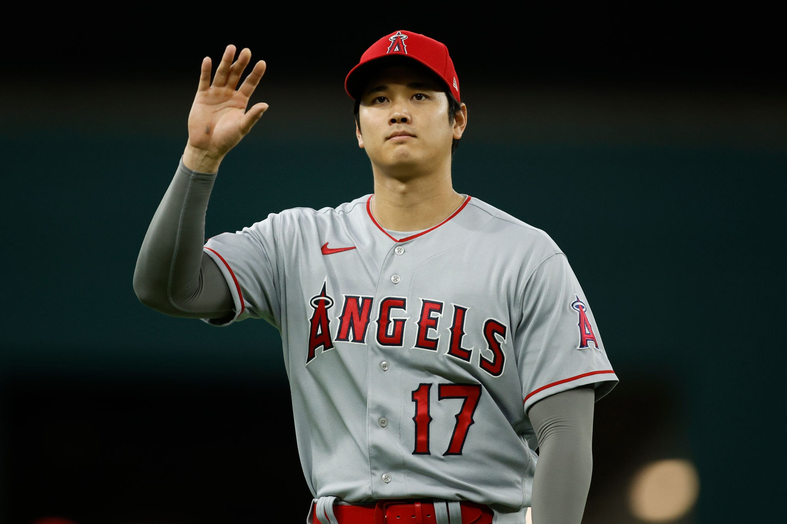

## {background-color="#0a0a0a"}

::: {style="text-align: center; margin-top: 8%;"}

[How should you rank alternatives]{style="font-size: 1.6em; color: #e8e8e8; font-weight: 300; letter-spacing: 0.02em;"}

[when dimensions have a]{style="font-size: 1.6em; color: #e8e8e8; font-weight: 300; letter-spacing: 0.02em;"}

[natural priority order?]{style="font-size: 1.6em; color: #f0c040; font-weight: 500; letter-spacing: 0.02em;"}

<br><br>

[Eduardo Zambrano]{style="font-size: 1.1em; color: #999; font-weight: 400; letter-spacing: 0.08em; text-transform: uppercase;"}

[Axiomatizations of Priority-Based Ranking Rules]{style="font-size: 0.75em; color: #666; font-style: italic;"}
:::

---

## {#motivation background-color="#0a0a0a"}

::: {style="text-align: center; margin-top: 12%;"}

[A hiring committee evaluates candidates by publications across journal tiers.]{style="font-size: 1.25em; color: #ccc; line-height: 1.8;"}

:::{style="margin-top: 2em;"}
[Top-5 &ensp;]{style="font-size: 2em; color: #f0c040; font-weight: 600;"}
[$>_p$ &ensp;]{style="font-size: 1.4em; color: #666;"}
[A* &ensp;]{style="font-size: 1.7em; color: #d4a030; font-weight: 500;"}
[$>_p$ &ensp;]{style="font-size: 1.4em; color: #666;"}
[A &ensp;]{style="font-size: 1.4em; color: #b08020; font-weight: 400;"}
[$>_p$ &ensp;]{style="font-size: 1.4em; color: #666;"}
[B &ensp;]{style="font-size: 1.15em; color: #907020; font-weight: 300;"}
[$>_p$ &ensp;]{style="font-size: 1.4em; color: #666;"}
[C]{style="font-size: 0.95em; color: #706020; font-weight: 300;"}
:::

<br>

[How many B-publications equal one Top-5?]{style="font-size: 1.15em; color: #888; font-style: italic;"}
:::

::: {style="position: absolute; bottom: 1em; right: 1.5em;"}
[[more examples →](#app-motivation)]{style="font-size: 0.6em; color: #555;"}
:::

---

## {background-color="#0a0a0a"}

::: {style="margin-top: 6%;"}

:::: {.columns}

::: {.column width="50%"}
::: {style="padding: 2em; border-right: 1px solid #333;"}
[The standard approach]{style="font-size: 1.3em; color: #999; font-weight: 300; text-transform: uppercase; letter-spacing: 0.1em;"}

<br>

[Assign **weights** to each dimension.]{style="font-size: 1.1em; color: #ccc; line-height: 2;"}

[Compute a **weighted sum**.]{style="font-size: 1.1em; color: #ccc; line-height: 2;"}

[Rank by the number.]{style="font-size: 1.1em; color: #ccc; line-height: 2;"}

<br><br>

[Requires choosing weights---]{style="font-size: 1em; color: #888;"}

[an inherently **arbitrary** step.]{style="font-size: 1em; color: #f07070;"}

[Assumes **commensurability**]{style="font-size: 1em; color: #f07070;"}

[across dimensions.]{style="font-size: 1em; color: #888;"}
:::
:::

::: {.column width="50%"}
::: {style="padding: 2em;"}
[The axiomatic approach]{style="font-size: 1.3em; color: #f0c040; font-weight: 300; text-transform: uppercase; letter-spacing: 0.1em;"}

<br>

[State the **principles** you believe in.]{style="font-size: 1.1em; color: #ccc; line-height: 2;"}

[Derive the **unique rule** they imply.]{style="font-size: 1.1em; color: #ccc; line-height: 2;"}

[The rule justifies itself.]{style="font-size: 1.1em; color: #ccc; line-height: 2;"}

<br><br>

[No weights to choose.]{style="font-size: 1em; color: #999;"}

[No commensurability assumed.]{style="font-size: 1em; color: #999;"}

[**Normative transparency.**]{style="font-size: 1em; color: #70d070;"}
:::
:::

::::

:::

---

## {#bj background-color="#0a0a0a"}

::: {style="text-align: center; margin-top: 6%;"}

[Barber&agrave; and Jackson (JET, 1988)]{style="font-size: 1.5em; color: #e8e8e8; font-weight: 400;"}

<br>

[Axiomatically characterized three ranking rules]{style="font-size: 1.1em; color: #999;"}

[for real vectors **without weights**.]{style="font-size: 1.1em; color: #ccc;"}

:::

<br>

::: {style="max-width: 80%; margin: 0 auto; font-size: 0.88em;"}

| **Rule** | **How it works** | **Philosophy** |
|:---|:---|:---|
| Maximin | Compare $\min_i x_i$ | Worst coordinate decides |
| Leximin | Sort, then compare lexicographically | Improve the worst off first |
| Protective | Which thresholds are met, by how many | Breadth of threshold coverage |

: {tbl-colwidths="[18,40,32]"}

:::

::: {style="text-align: center; margin-top: 1.5em;"}
[Three rules, each justified by axioms — no weights needed.]{style="font-size: 0.95em; color: #888;"}
:::

::: {style="position: absolute; bottom: 1em; right: 1.5em;"}
[[worked example →](#app-bj-example)]{style="font-size: 0.6em; color: #555;"}
:::

---

## {background-color="#0a0a0a"}

::: {style="text-align: center; margin-top: 12%;"}

[But their framework assumes]{style="font-size: 1.3em; color: #888;"}

[all dimensions are **symmetric**.]{style="font-size: 1.5em; color: #f07070;"}

<br><br>

[It cannot distinguish a Top-5 from a B.]{style="font-size: 1.1em; color: #777; font-style: italic;"}

[It cannot distinguish medicine funding from humanities funding.]{style="font-size: 1.1em; color: #777; font-style: italic;"}

[It cannot distinguish ICU protection from general ward protection.]{style="font-size: 1.1em; color: #777; font-style: italic;"}

:::

---

## {background-color="#0a0a0a"}

::: {style="text-align: center; margin-top: 8%;"}

[This paper]{style="font-size: 1.5em; color: #f0c040; font-weight: 500;"}

<br>

[extends the axiomatic approach to settings where]{style="font-size: 1.15em; color: #ccc;"}

[dimensions carry an **exogenous priority order**.]{style="font-size: 1.15em; color: #e8e8e8;"}

<br><br>

[Six rules. &ensp; Three families. &ensp; Three philosophies.]{style="font-size: 1.2em; color: #999; letter-spacing: 0.02em;"}

<br>

[Each characterized by a small set of axioms]{style="font-size: 1em; color: #777;"}

[with independent normative content.]{style="font-size: 1em; color: #777;"}

:::

---

## {background-color="#0a0a0a" auto-animate=true}

::: {style="text-align: center; margin-top: 2%;"}
[Three families]{style="font-size: 1.6em; color: #e8e8e8; font-weight: 300;"}
:::

:::: {.columns}

::: {.column width="33%"}
::: {style="text-align: center; padding: 1.2em; border: 1px solid #444; border-radius: 12px; margin: 0.5em; background: linear-gradient(180deg, #1a1520 0%, #0a0a0a 100%);"}
[Quality-first]{style="font-size: 1.2em; color: #c490f0; font-weight: 500;"}

[Only top-tier performance matters]{style="font-size: 0.9em; color: #aaa;"}

[**PMM** · **PLS**]{style="font-size: 1.1em; color: #c490f0;"}

[No lower-tier output offsets a higher-tier deficit]{style="font-size: 0.8em; color: #777;"}
:::
:::

::: {.column width="33%"}
::: {style="text-align: center; padding: 1.2em; border: 1px solid #444; border-radius: 12px; margin: 0.5em; background: linear-gradient(180deg, #15201a 0%, #0a0a0a 100%);"}
[Quantity-first]{style="font-size: 1.2em; color: #70d0a0; font-weight: 500;"}

[Aggregate output matters most]{style="font-size: 0.9em; color: #aaa;"}

[**TMM** · **TLS**]{style="font-size: 1.1em; color: #70d0a0;"}

[Trade-offs across tiers are permitted]{style="font-size: 0.8em; color: #777;"}
:::
:::

::: {.column width="33%"}
::: {style="text-align: center; padding: 1.2em; border: 1px solid #444; border-radius: 12px; margin: 0.5em; background: linear-gradient(180deg, #201a15 0%, #0a0a0a 100%);"}
[Level-first]{style="font-size: 1.2em; color: #f0a050; font-weight: 500;"}

[Which thresholds are met matters]{style="font-size: 0.9em; color: #aaa;"}

[**P-PROT** · **Q-PROT**]{style="font-size: 1.1em; color: #f0a050;"}

[Advantages at one threshold cannot offset others]{style="font-size: 0.8em; color: #777;"}
:::
:::

::::

---

## {background-color="#0a0a0a"}

::: {style="text-align: center; margin-top: 5%;"}
[The six rules]{style="font-size: 1.5em; color: #e8e8e8; font-weight: 300;"}
:::

<br>

::: {style="font-size: 0.85em; margin: 0 auto; max-width: 90%;"}

| | **Rule** | | **Philosophy** | **What it compares** | **Decision** |
|:---|:---|:---|:---|:---|:---|
| [&#9632;]{style="color: #c490f0;"} | PMM | [B&J]{style="font-size: 0.7em; color: #666; font-style: italic;"} | Quality-first | Top coordinate $x_1$ | Highest-priority score wins |
| [&#9632;]{style="color: #c490f0;"} | PLS | [B&J]{style="font-size: 0.7em; color: #666; font-style: italic;"} | Quality-first | $(x_1, x_2, \ldots, x_n)$ | First difference decides |
| [&#9632;]{style="color: #70d0a0;"} | TMM | [**new**]{style="font-size: 0.7em; color: #f0c040;"} | Quantity-first | Total $S_n = \sum x_i$ | Highest total wins |
| [&#9632;]{style="color: #70d0a0;"} | TLS | [**new**]{style="font-size: 0.7em; color: #f0c040;"} | Quantity-first | $(S_n, S_{n-1}, \ldots, S_1)$ | Total first, then prefix sums |
| [&#9632;]{style="color: #f0a050;"} | P-PROT | [B&J]{style="font-size: 0.7em; color: #666; font-style: italic;"} | Level-first | Coverage sets $H_a$ | Lowest differing threshold |
| [&#9632;]{style="color: #f0a050;"} | Q-PROT | [**new**]{style="font-size: 0.7em; color: #f0c040;"} | Level-first | Coverage sets $H_a$ | Highest differing threshold |

: {tbl-colwidths="[3,8,14,28,28]"}

:::

::: {style="text-align: center; margin-top: 1.5em;"}
[$H_a(x) = \{i : x_i \geq a\}$ &mdash; the set of coordinates that "meet threshold $a$"]{style="font-size: 0.8em; color: #777;"}
:::

---

## {#six-example background-color="#0a0a0a"}

::: {style="text-align: center; margin-top: 3%;"}
[All six rules on one example]{style="font-size: 1.4em; color: #e8e8e8; font-weight: 300;"}
:::

::: {style="text-align: center; margin-top: 0.8em;"}
[$n = 4$ &emsp; $x = (3, 0, 2, 1)$ &emsp; $y = (3, 1, 0, 2)$]{style="font-size: 1.15em; color: #ccc; font-family: 'Source Code Pro', monospace;"}

[Prefix sums: &ensp; $S(x) = (3, 3, 5, 6)$ &emsp; $S(y) = (3, 4, 4, 6)$]{style="font-size: 0.95em; color: #888;"}
:::

:::: {.columns}

::: {.column width="33%"}
::: {style="text-align: center; padding: 1em; border: 1px solid #444; border-radius: 8px; margin: 0.3em; background: #141018;"}
[Quality-first]{style="font-size: 0.9em; color: #c490f0; text-transform: uppercase; letter-spacing: 0.08em;"}

[PMM: $x_1 = y_1 = 3$ &rarr; indifferent]{style="font-size: 0.9em; color: #ddd;"}

[PLS: first diff at 2: $0 < 1$ &rarr; $y$]{style="font-size: 0.9em; color: #ddd;"}

[PMM **is indifferent**; PLS picks $y$]{style="font-size: 0.85em; color: #c490f0; font-weight: 500;"}
:::
:::

::: {.column width="33%"}
::: {style="text-align: center; padding: 1em; border: 1px solid #444; border-radius: 8px; margin: 0.3em; background: #101a14;"}
[Quantity-first]{style="font-size: 0.9em; color: #70d0a0; text-transform: uppercase; letter-spacing: 0.08em;"}

[TMM: $S_4 = 6 = 6$ &rarr; indifferent]{style="font-size: 0.9em; color: #ddd;"}

[TLS: $S_3 = 5 > 4$ &rarr; $x$]{style="font-size: 0.9em; color: #ddd;"}

[TMM **is indifferent**; TLS picks $x$]{style="font-size: 0.85em; color: #70d0a0; font-weight: 500;"}
:::
:::

::: {.column width="33%"}
::: {style="text-align: center; padding: 1em; border: 1px solid #444; border-radius: 8px; margin: 0.3em; background: #1a1510;"}
[Level-first]{style="font-size: 0.9em; color: #f0a050; text-transform: uppercase; letter-spacing: 0.08em;"}

[P-PROT: $a^*\!=\!1$, $r^*\!=\!2 \in H_1(y)$ &rarr; $y$]{style="font-size: 0.9em; color: #ddd;"}

[Q-PROT: $a^*\!=\!2$, $r^*\!=\!3 \in H_2(x)$ &rarr; $x$]{style="font-size: 0.9em; color: #ddd;"}

[P-PROT picks $y$; Q-PROT picks $x$]{style="font-size: 0.85em; color: #f0a050; font-weight: 500;"}
:::
:::

::::

<br>

::: {style="text-align: right; max-width: 90%; margin: 0 auto;"}
[[under B&J symmetry →](#app-bj-symmetry)]{style="font-size: 0.6em; color: #555;"}
:::

---

## {background-color="#0a0a0a"}

::: {style="text-align: center; margin-top: 8%;"}
[From rules to axioms]{style="font-size: 1.6em; color: #f0c040; font-weight: 400;"}

<br>

[Each rule is **uniquely** determined by a small set of principles]{style="font-size: 1.1em; color: #ccc;"}

[that a decision-maker can directly evaluate.]{style="font-size: 1.1em; color: #ccc;"}

<br><br>

[Not "this is the rule."]{style="font-size: 1em; color: #777;"}

[But rather: "if you believe *these* principles,]{style="font-size: 1em; color: #aaa;"}

[then *this* is the only rule consistent with them."]{style="font-size: 1em; color: #e8e8e8;"}

:::

---

## {background-color="#0a0a0a"}

::: {style="text-align: center; margin-top: 3%;"}
[The standard axioms]{style="font-size: 1.4em; color: #e8e8e8; font-weight: 300;"}
:::

::: {style="max-width: 85%; margin: 1.5em auto 0; font-size: 0.95em;"}

| Axiom | Meaning |
|:------|:--------|
| **C** &mdash; Completeness | All pairs comparable: &ensp; $x \succeq y$ or $y \succeq x$ |
| **T** &mdash; Transitivity | Consistent rankings: &ensp; $x \succeq y,\; y \succeq z \Rightarrow x \succeq z$ |
| **PD** &mdash; Pareto Dominance | $x_i \geq y_i\;\forall i,\; x_j > y_j$ some $j \;\Rightarrow\; x \succ y$ |

: {tbl-colwidths="[30,70]"}

:::

---

## {background-color="#0a0a0a"}

::: {style="text-align: center; margin-top: 3%;"}
[Monotonicity and indifference]{style="font-size: 1.4em; color: #e8e8e8; font-weight: 300;"}
:::

:::: {.columns style="margin-top: 1.5em;"}

::: {.column width="50%"}
::: {style="padding: 1.2em 1.5em; border-left: 4px solid #c490f0; margin: 0.5em; background: #0f0d14;"}
[**TCM** &mdash; Top-Coordinate Monotonicity]{style="font-size: 1em; color: #c490f0;"}

[$x_1 > y_1 \;\Rightarrow\; x \succ y$]{style="font-size: 0.95em; color: #ddd;"}

[Higher top-coordinate is strictly better]{style="font-size: 0.85em; color: #888;"}
:::

::: {style="padding: 1.2em 1.5em; border-left: 4px solid #c490f0; margin: 0.5em; background: #0f0d14;"}
[**TCI** &mdash; Top-Coordinate Indifference]{style="font-size: 1em; color: #c490f0;"}

[$x_1 = y_1 \;\Rightarrow\; x \sim y$]{style="font-size: 0.95em; color: #ddd;"}

[Same top-coordinate means indifference]{style="font-size: 0.85em; color: #888;"}
:::
:::

::: {.column width="50%"}
::: {style="padding: 1.2em 1.5em; border-left: 4px solid #70d0a0; margin: 0.5em; background: #0d140f;"}
[**TM** &mdash; Total Monotonicity]{style="font-size: 1em; color: #70d0a0;"}

[$S_n(x) > S_n(y) \;\Rightarrow\; x \succ y$]{style="font-size: 0.95em; color: #ddd;"}

[Higher total sum is strictly better]{style="font-size: 0.85em; color: #888;"}
:::

::: {style="padding: 1.2em 1.5em; border-left: 4px solid #70d0a0; margin: 0.5em; background: #0d140f;"}
[**TI** &mdash; Total Indifference]{style="font-size: 1em; color: #70d0a0;"}

[$S_n(x) = S_n(y) \;\Rightarrow\; x \sim y$]{style="font-size: 0.95em; color: #ddd;"}

[Same total sum means indifference]{style="font-size: 0.85em; color: #888;"}
:::
:::

::::

---

## {background-color="#0a0a0a"}

::: {style="text-align: center; margin-top: 3%;"}
[The compensation axioms]{style="font-size: 1.4em; color: #e8e8e8; font-weight: 300;"}
:::

<br>

::: {style="max-width: 92%; margin: 0 auto;"}

::: {style="padding: 1.2em 1.5em; border-left: 4px solid #c490f0; margin-bottom: 1.2em; background: #0f0d14;"}
[**NCA** &mdash; Non-Compensability Across Levels]{style="font-size: 1.05em; color: #c490f0;"}

[If $x_k > y_k$ at the first differing coordinate, no amount of advantage at coordinates $k+1, \ldots, n$ can make $y$ strictly beat $x$.]{style="font-size: 0.95em; color: #bbb; line-height: 1.6;"}

["No lower-tier excellence compensates for a higher-tier deficit."]{style="font-size: 0.9em; color: #888; font-style: italic;"}
:::

::: {style="padding: 1.2em 1.5em; border-left: 4px solid #70d0a0; margin-bottom: 0; background: #0d140f;"}
[**GUT** &mdash; Generalized Upward Transfer]{style="font-size: 1.05em; color: #70d0a0;"}

[Redistributing mass from coordinate $k+1$ to any combination of $1, \ldots, k$ (preserving the total) is strictly better.]{style="font-size: 0.95em; color: #bbb; line-height: 1.6;"}

["Concentrating output at higher-priority dimensions is always better."]{style="font-size: 0.9em; color: #888; font-style: italic;"}
:::

:::

---

## {background-color="#0a0a0a"}

::: {style="text-align: center; margin-top: 3%;"}
[The compensation axioms [*(continued)*]{style="font-size: 0.7em; color: #888;"}]{style="font-size: 1.4em; color: #e8e8e8; font-weight: 300;"}
:::

<br>

::: {style="max-width: 92%; margin: 0 auto;"}

::: {style="padding: 1.2em 1.5em; border-left: 4px solid #f0a050; margin-bottom: 1.2em; background: #140f0d;"}
[**NUTC** &mdash; No Upward Threshold Compensation]{style="font-size: 1.05em; color: #f0a050;"}

[A coverage advantage at a low threshold cannot be offset by differences at higher thresholds.]{style="font-size: 0.95em; color: #bbb; line-height: 1.6;"}

["Safety first": meeting basic thresholds broadly matters most.]{style="font-size: 0.9em; color: #888; font-style: italic;"}
:::

::: {style="padding: 1.2em 1.5em; border-left: 4px solid #f0a050; margin-bottom: 0; background: #140f0d;"}
[**NDTC** &mdash; No Downward Threshold Compensation]{style="font-size: 1.05em; color: #f0a050;"}

[A coverage advantage at a high threshold cannot be offset by differences at lower thresholds.]{style="font-size: 0.95em; color: #bbb; line-height: 1.6;"}

["Excellence first": meeting the highest thresholds matters most.]{style="font-size: 0.9em; color: #888; font-style: italic;"}
:::

:::

---

## {#char-theorems background-color="#0a0a0a"}

::: {style="text-align: center; margin-top: 2%;"}
[The characterization theorems]{style="font-size: 1.4em; color: #e8e8e8; font-weight: 300;"}
:::

<br>

::: {style="max-width: 85%; margin: 0 auto; font-size: 0.88em;"}

| | **Rule** | **$=$ Axioms** | **Key axiom** |
|:---|:---|:---|:---|
| [&#9632;]{style="color: #c490f0;"} | PMM | TCM + TCI | Only top coordinate matters |
| [&#9632;]{style="color: #c490f0;"} | **PLS** | **C + T + PD + NCA** | No compensation across tiers |
| | | | |
| [&#9632;]{style="color: #70d0a0;"} | TMM | TM + TI | Only total matters |
| [&#9632;]{style="color: #70d0a0;"} | **TLS** | **C + TM + GUT** | Upward transfer is better |
| | | | |
| [&#9632;]{style="color: #f0a050;"} | **P-PROT** | **C + T + PD + NUTC** | Safety first |
| [&#9632;]{style="color: #f0a050;"} | **Q-PROT** | **C + T + PD + NDTC** | Excellence first |

: {tbl-colwidths="[3,9,28,35]"}

:::

::: {style="text-align: center; margin-top: 1.5em;"}
[Each characterization is an **if and only if**. &ensp; All axioms are **independent**.]{style="font-size: 0.9em; color: #999;"}
:::

<br>

::: {style="text-align: right; max-width: 85%; margin: 0 auto;"}
[[axiom satisfaction table →](#app-axiom-table)]{style="font-size: 0.6em; color: #555;"}
:::

---

## {background-color="#0a0a0a"}

::: {style="text-align: center; margin-top: 4%;"}
[Impossibility]{style="font-size: 1.6em; color: #f07070; font-weight: 400;"}

[The foundation axioms are **pairwise incompatible**.]{style="font-size: 1.15em; color: #ccc;"}

[No single preference can straddle two families.]{style="font-size: 1em; color: #999;"}
:::

::: {style="max-width: 75%; margin: 1.5em auto 0; font-size: 0.95em;"}

| | [TCM]{style="color: #c490f0;"} | [TM]{style="color: #70d0a0;"} | [NUTC]{style="color: #f0a050;"} | [NDTC]{style="color: #f0a050;"} |
|:---|:---:|:---:|:---:|:---:|
| [**TCM**]{style="color: #c490f0;"} | | &#10007; | &#10007; | &#10007; |
| [**TM**]{style="color: #70d0a0;"} | &#10007; | | &#10007; | &#10007; |
| [**NUTC**]{style="color: #f0a050;"} | &#10007; | &#10007; | | |
| [**NDTC**]{style="color: #f0a050;"} | &#10007; | &#10007; | | |

:::

::: {style="text-align: center; margin-top: 1.2em;"}
[Each [&#10007;]{style="color: #f07070;"} is a theorem: no preference on $\mathbb{R}^n$ satisfies both axioms simultaneously.]{style="font-size: 0.85em; color: #888;"}
:::

---

## {background-color="#0a0a0a"}

::: {style="text-align: center; margin-top: 3%;"}
[The deeper question: commensurability]{style="font-size: 1.4em; color: #f0c040; font-weight: 400;"}
:::

:::: {.columns style="margin-top: 1em;"}

::: {.column width="50%"}
::: {style="text-align: center; padding: 1.2em;"}
[Dimensions **commensurable**]{style="font-size: 1.1em; color: #ccc; font-weight: 500;"}

[Same currency, different quality levels]{style="font-size: 0.95em; color: #999;"}

[Publications across journal tiers]{style="font-size: 0.9em; color: #777; font-style: italic;"}

[Prefix sums are meaningful:]{style="font-size: 0.95em; color: #aaa;"}

["total output at tier $j$ or above"]{style="font-size: 0.95em; color: #aaa;"}

[FOSD-respect is desirable]{style="font-size: 0.95em; color: #aaa;"}

<br>

[&rarr; [Quality-first]{style="color: #c490f0;"} or [Quantity-first]{style="color: #70d0a0;"}]{style="font-size: 1.05em; font-weight: 500;"}
:::
:::

::: {.column width="50%"}
::: {style="text-align: center; padding: 1.2em;"}
[Dimensions **incommensurable**]{style="font-size: 1.1em; color: #ccc; font-weight: 500;"}

[Qualitatively distinct dimensions]{style="font-size: 0.95em; color: #999;"}

[Failure modes by criticality]{style="font-size: 0.9em; color: #777; font-style: italic;"}

[Prefix sums aggregate unlike quantities:]{style="font-size: 0.95em; color: #aaa;"}

[no normative meaning]{style="font-size: 0.95em; color: #aaa;"}

[FOSD violation is a *feature*]{style="font-size: 0.95em; color: #aaa;"}

<br>

[&rarr; [Level-first]{style="color: #f0a050;"}]{style="font-size: 1.05em; font-weight: 500;"}
:::
:::

::::

---

## {background-color="#0a0a0a"}

::: {style="text-align: center; margin-top: 3%;"}
[Six settings, six rules]{style="font-size: 1.4em; color: #e8e8e8; font-weight: 300;"}
:::

<br>

::: {style="max-width: 92%; margin: 0 auto; font-size: 0.82em;"}

| | **Application** | **Rule** | **Why this rule** |
|:---|:---|:---|:---|
| [&#9632;]{style="color: #c490f0;"} | Executive screening | PMM | Only the top tier matters |
| [&#9632;]{style="color: #c490f0;"} | Publications across journal tiers | PLS | Top tier first; among equals, next tier decides |
| [&#9632;]{style="color: #70d0a0;"} | Fundraising across priority areas | TMM | For the bottom line, only the total matters |
| [&#9632;]{style="color: #70d0a0;"} | Olympic medal rankings | TLS | Total medals first; among equals, favor better ones |
| [&#9632;]{style="color: #f0a050;"} | Infection control across risk categories | P-PROT | Breadth of coverage; protect the most critical categories first |
| [&#9632;]{style="color: #f0a050;"} | Scouting baseball prospects | Q-PROT | Depth of coverage; peak excellence matters most |

: {tbl-colwidths="[3,30,7,40]"}

:::

---

## {background-color="#0a0a0a"}

::: {style="text-align: center; margin-top: 3%;"}
[PMM &mdash; Executive screening]{style="font-size: 1.3em; color: #c490f0; font-weight: 400;"}
:::

::: {style="text-align: center; margin-top: 0.8em;"}
[Candidates rated on: &ensp; [Vision]{style="color: #c490f0; font-weight: 500;"} $>_p$ [Operations]{style="color: #c490f0;"} $>_p$ [Communication]{style="color: #c490f0;"}]{style="font-size: 1em; color: #aaa;"}
:::

::: {style="max-width: 70%; margin: 1.5em auto 0; font-size: 0.95em;"}

| | Vision | Operations | Communication |
|:---|:---:|:---:|:---:|
| **Candidate A** | 9 | 3 | 2 |
| **Candidate B** | 7 | 8 | 8 |

:::

::: {style="text-align: center; margin-top: 1.5em;"}
[PMM compares only the top coordinate: &ensp; $9 > 7$]{style="font-size: 1.05em; color: #ddd;"}

[&rarr; **Candidate A wins**]{style="font-size: 1.1em; color: #c490f0; font-weight: 500;"}
:::

::: {style="text-align: center; margin-top: 1.2em;"}
[B is stronger in every other dimension &mdash; but PMM doesn't care.]{style="font-size: 0.9em; color: #888;"}

[At the shortlisting stage, only strategic vision matters.]{style="font-size: 0.9em; color: #888; font-style: italic;"}
:::

---

## {background-color="#0a0a0a"}

::: {style="text-align: center; margin-top: 3%;"}
[PLS &mdash; Publications across journal tiers]{style="font-size: 1.3em; color: #c490f0; font-weight: 400;"}
:::

::: {style="text-align: center; margin-top: 0.8em;"}
[Journal tiers: &ensp; [Top-5]{style="color: #c490f0; font-weight: 500;"} $>_p$ [A*]{style="color: #c490f0;"} $>_p$ [A]{style="color: #c490f0;"} $>_p$ [B]{style="color: #c490f0;"}]{style="font-size: 1em; color: #aaa;"}
:::

::: {style="max-width: 70%; margin: 1.5em auto 0; font-size: 0.95em;"}

| | Top-5 | A* | A | B |
|:---|:---:|:---:|:---:|:---:|
| **Candidate A** | 2 | 1 | 3 | 0 |
| **Candidate B** | 2 | 1 | 0 | 12 |

:::

::: {style="text-align: center; margin-top: 1.5em;"}
[PLS: Top-5 tied, A* tied, first difference at A: &ensp; $3 > 0$]{style="font-size: 1.05em; color: #ddd;"}

[&rarr; **Candidate A wins**]{style="font-size: 1.1em; color: #c490f0; font-weight: 500;"}
:::

::: {style="text-align: center; margin-top: 1.2em;"}
[No number of B-publications compensates for an A-publication deficit.]{style="font-size: 0.9em; color: #888; font-style: italic;"}
:::

---

## {background-color="#0a0a0a"}

::: {style="text-align: center; margin-top: 3%;"}
[TMM &mdash; Fundraising across priority areas]{style="font-size: 1.3em; color: #70d0a0; font-weight: 400;"}
:::

::: {style="text-align: center; margin-top: 0.8em;"}
[Priority areas: &ensp; [Medicine]{style="color: #70d0a0; font-weight: 500;"} $>_p$ [Engineering]{style="color: #70d0a0;"} $>_p$ [Humanities]{style="color: #70d0a0;"}]{style="font-size: 1em; color: #aaa;"}
:::

::: {style="max-width: 70%; margin: 1.5em auto 0; font-size: 0.95em;"}

| | Medicine | Engineering | Humanities |
|:---|:---:|:---:|:---:|
| **Campaign X** | \$2M | \$0 | \$0 |
| **Campaign Y** | \$1M | \$1M | \$1M |

:::

::: {style="text-align: center; margin-top: 1.5em;"}
[TMM compares only totals: &ensp; \$3M $>$ \$2M]{style="font-size: 1.05em; color: #ddd;"}

[&rarr; **Campaign Y wins**]{style="font-size: 1.1em; color: #70d0a0; font-weight: 500;"}
:::

::: {style="text-align: center; margin-top: 1.2em;"}
[X concentrates in medicine, but Y raises more overall.]{style="font-size: 0.9em; color: #888;"}

[For the bottom line, only the total matters.]{style="font-size: 0.9em; color: #888; font-style: italic;"}
:::

---

## {background-color="#0a0a0a"}

::: {style="text-align: center; margin-top: 3%;"}
[TLS &mdash; Olympic medal rankings]{style="font-size: 1.3em; color: #70d0a0; font-weight: 400;"}
:::

::: {style="text-align: center; margin-top: 0.8em;"}
[Medal tiers: &ensp; [Gold]{style="color: #70d0a0; font-weight: 500;"} $>_p$ [Silver]{style="color: #70d0a0;"} $>_p$ [Bronze]{style="color: #70d0a0;"}]{style="font-size: 1em; color: #aaa;"}
:::

::: {style="max-width: 70%; margin: 1.5em auto 0; font-size: 0.95em;"}

| | Gold | Silver | Bronze | Total |
|:---|:---:|:---:|:---:|:---:|
| **Country A** | 2 | 3 | 1 | 6 |
| **Country B** | 1 | 1 | 4 | 6 |

:::

::: {style="text-align: center; margin-top: 1.5em;"}
[Totals tied at 6. &ensp; Prefix sums: $S(A) = (2, 5, 6)$ vs $S(B) = (1, 2, 6)$.]{style="font-size: 1em; color: #ddd;"}

[Golds tied at $S_1$. &ensp; First difference at $S_2$: &ensp; $5 > 2$ &ensp; &rarr; **Country A wins**]{style="font-size: 1.1em; color: #70d0a0; font-weight: 500;"}
:::

::: {style="text-align: center; margin-top: 1.2em;"}
[TLS: total first; among equals, concentration at the top decides.]{style="font-size: 0.9em; color: #888; font-style: italic;"}
:::

---

## {background-color="#0a0a0a"}

::: {style="text-align: center; margin-top: 3%;"}
[P-PROT &mdash; Infection control across risk categories]{style="font-size: 1.3em; color: #f0a050; font-weight: 400;"}
:::

::: {style="text-align: center; margin-top: 0.8em;"}
[Risk categories: &ensp; [ICU]{style="color: #f0a050; font-weight: 500;"} $>_p$ [Surgical]{style="color: #f0a050;"} $>_p$ [General ward]{style="color: #f0a050;"}]{style="font-size: 1em; color: #aaa;"}
:::

::: {style="max-width: 70%; margin: 1.5em auto 0; font-size: 0.95em;"}

| | ICU | Surgical | General ward |
|:---|:---:|:---:|:---:|
| **Protocol A** | 1 | 1 | 1 |
| **Protocol B** | 3 | 0 | 0 |

:::

::: {style="text-align: center; margin-top: 1.5em;"}
[Lowest differing threshold: $a^* = 1$. &ensp; $H_1(A) = \{1, 2, 3\}$ vs $H_1(B) = \{1\}$.]{style="font-size: 1em; color: #ddd;"}

[Priority tiebreak: $r^* = 2 \in H_1(A)$ &ensp; &rarr; **Protocol A wins**]{style="font-size: 1.1em; color: #f0a050; font-weight: 500;"}
:::

::: {style="text-align: center; margin-top: 1.2em;"}
[B is excellent in ICU but leaves surgical and general wards unprotected.]{style="font-size: 0.9em; color: #888;"}

[P-PROT demands breadth, then gives the most critical categories priority.]{style="font-size: 0.9em; color: #888; font-style: italic;"}
:::

---

## {background-color="#0a0a0a"}

::: {style="text-align: center; margin-top: 3%;"}
[Q-PROT &mdash; Scouting baseball prospects]{style="font-size: 1.3em; color: #f0a050; font-weight: 400;"}
:::

::: {style="text-align: center; margin-top: 0.8em;"}
[Skills: &ensp; [Hitting]{style="color: #f0a050; font-weight: 500;"} $>_p$ [Fielding]{style="color: #f0a050;"} $>_p$ [Speed]{style="color: #f0a050;"}]{style="font-size: 1em; color: #aaa;"}
:::

::: {style="max-width: 70%; margin: 1.5em auto 0; font-size: 0.95em;"}

| | Hitting | Fielding | Speed |
|:---|:---:|:---:|:---:|
| **Player X** | 2 | 1 | 2 |
| **Player Y** | 1 | 3 | 0 |

:::

::: {style="text-align: center; margin-top: 1.5em;"}
[Highest differing threshold: $a^* = 3$. &ensp; $H_3(Y) = \{2\}$ vs $H_3(X) = \emptyset$.]{style="font-size: 1em; color: #ddd;"}

[&rarr; **Player Y wins**]{style="font-size: 1.1em; color: #f0a050; font-weight: 500;"}
:::

::: {style="text-align: center; margin-top: 1.2em;"}
[X is well-rounded but has no elite skill. Y has an elite glove.]{style="font-size: 0.9em; color: #888;"}

[Q-PROT rewards peak excellence: the player who clears the highest bar.]{style="font-size: 0.9em; color: #888; font-style: italic;"}
:::

---

## {#back-to-bj background-color="#0a0a0a"}

::: {style="text-align: center; margin-top: 3%;"}
[Back to Barber&agrave; &amp; Jackson (1988)]{style="font-size: 1.4em; color: #e8e8e8; font-weight: 300;"}
:::

::: {style="max-width: 88%; margin: 1.5em auto 0; font-size: 0.85em;"}

| **B&J (Symmetric)** | **This paper (Priority)** | **What changed** |
|:---|:---|:---|
| Maximin ($\min_i x_i$) | [PMM ($x_1$)]{style="color: #c490f0;"} | Symmetry &rarr; Top-coordinate focus |
| Leximin (sorted lex) | [PLS (coordinate lex)]{style="color: #c490f0;"} | Sorting &rarr; NCA |
| Protective (coverage) | [P-PROT (coverage + priority)]{style="color: #f0a050;"} | Symmetry &rarr; Priority tiebreak |
| --- | [**TMM, TLS**]{style="color: #70d0a0;"}, [**Q-PROT**]{style="color: #f0a050;"} | **New**: no symmetric counterpart |

: {tbl-colwidths="[28,30,32]"}

:::

---

## {background-color="#0a0a0a"}

::: {style="text-align: center; margin-top: 4%;"}
[A hidden fault line]{style="font-size: 1.4em; color: #f0c040; font-weight: 400;"}
:::

::: {style="max-width: 85%; margin: 1.5em auto 0;"}

::: {style="padding: 1em 1.5em; border-left: 3px solid #888;"}
[Maximin and Leximin **sort then aggregate** &mdash; combining values across dimensions into a single comparison. This implicitly treats dimensions as commensurable.]{style="font-size: 0.95em; color: #bbb;"}

[The Protective criterion checks each dimension against a threshold, then **counts** &mdash; no cross-dimensional aggregation.]{style="font-size: 0.95em; color: #bbb;"}

[Under symmetry, both approaches happen to agree &mdash; so the structural difference is invisible.]{style="font-size: 0.95em; color: #999; font-style: italic;"}
:::

:::

---

## {background-color="#0a0a0a"}

::: {style="text-align: center; margin-top: 4%;"}
[A hidden fault line [*(continued)*]{style="font-size: 0.7em; color: #888;"}]{style="font-size: 1.4em; color: #f0c040; font-weight: 400;"}
:::

::: {style="max-width: 85%; margin: 1.5em auto 0;"}

::: {style="padding: 1em 1.5em; border-left: 3px solid #f0c040;"}
[Drop symmetry, and the fault line becomes consequential:]{style="font-size: 1em; color: #e8e8e8;"}

[&ensp; [Quality-first]{style="color: #c490f0;"} and [Quantity-first]{style="color: #70d0a0;"} rely on **prefix sums** &mdash; dimensions must be commensurable.]{style="font-size: 0.95em; color: #ccc;"}

[&ensp; [Level-first]{style="color: #f0a050;"} uses **coverage sets** &mdash; no aggregation across dimensions.]{style="font-size: 0.95em; color: #ccc;"}

[The commensurability question, latent in B&J, becomes the organizing principle.]{style="font-size: 0.95em; color: #f0c040; font-style: italic;"}
:::

:::

---

## {#lean background-color="#0a0a0a"}

::: {style="text-align: center; margin-top: 5%;"}
[Formally verified in Lean 4]{style="font-size: 1.6em; color: #e8e8e8; font-weight: 400;"}
:::

<br>

::: {style="max-width: 80%; margin: 0 auto; text-align: center;"}

[All six characterization theorems &ensp; &#10003;]{style="font-size: 0.95em; color: #70d070;"}

[Both impossibility results &ensp; &#10003;]{style="font-size: 0.95em; color: #70d070;"}

[Refinement & equivalence relations &ensp; &#10003;]{style="font-size: 0.95em; color: #70d070;"}

[Axiom satisfaction & violation proofs &ensp; &#10003;]{style="font-size: 0.95em; color: #70d070;"}

:::

<br>

::: {style="text-align: center;"}

::: {style="display: inline-block; padding: 0.7em 3em; border: 1px solid #444; border-radius: 12px; background: #111;"}

[**0** `sorry`s]{style="font-size: 1.15em; color: #e8e8e8;"}

:::

:::

<br>

::: {style="max-width: 80%; margin: 0 auto; text-align: center;"}

[Every theorem in Lean is a **machine-checked proof**.]{style="font-size: 0.9em; color: #999;"}

:::

::: {style="position: absolute; bottom: 1em; right: 1.5em;"}
[[what is Lean? →](#app-intro-lean)]{style="font-size: 0.6em; color: #555;"} &ensp; [[Lean code example →](#app-lean-code)]{style="font-size: 0.6em; color: #555;"}
:::

---

## {background-color="#0a0a0a"}

::: {style="text-align: center; margin-top: 3%;"}

[Thank You!]{style="font-size: 2em; color: #f0c040; font-weight: 400;"}

{width="45%" style="margin-top: 0.5em; border-radius: 12px;"}

[[github.com/eduardo-zambrano/priority-ranking-lean](https://github.com/eduardo-zambrano/priority-ranking-lean)]{style="font-size: 0.7em; color: #555;"}

:::

---

## {#appendix background-color="#0a0a0a"}

::: {style="text-align: center; margin-top: 15%;"}

[Appendix]{style="font-size: 2em; color: #f0c040; font-weight: 400; letter-spacing: 0.05em;"}

:::

---

## {#app-motivation background-color="#0a0a0a"}

::: {style="text-align: center; margin-top: 10%;"}

[A university compares fundraising campaigns]{style="font-size: 1.25em; color: #ccc; line-height: 1.8;"}

[by projected revenue across priority areas.]{style="font-size: 1.25em; color: #ccc; line-height: 1.8;"}

:::{style="margin-top: 2em;"}
[Medicine &ensp;]{style="font-size: 1.9em; color: #70d0a0; font-weight: 600;"}
[$>_p$ &ensp;]{style="font-size: 1.4em; color: #666;"}
[Engineering &ensp;]{style="font-size: 1.6em; color: #50b080; font-weight: 500;"}
[$>_p$ &ensp;]{style="font-size: 1.4em; color: #666;"}
[Humanities]{style="font-size: 1.3em; color: #309060; font-weight: 400;"}
:::

:::{style="margin-top: 1.5em;"}
[Campaign X: \$2M from medicine alone. &emsp; Campaign Y: \$1M from each — \$3M total.]{style="font-size: 1em; color: #aaa;"}
:::

<br>

[Should a higher total from lower-priority areas beat a smaller sum from the top?]{style="font-size: 1.15em; color: #888; font-style: italic;"}
:::

---

## {background-color="#0a0a0a"}

::: {style="text-align: center; margin-top: 10%;"}

[A hospital ranks infection control protocols]{style="font-size: 1.25em; color: #ccc; line-height: 1.8;"}

[by performance across patient risk categories.]{style="font-size: 1.25em; color: #ccc; line-height: 1.8;"}

:::{style="margin-top: 2em;"}
[ICU &ensp;]{style="font-size: 1.9em; color: #f0a050; font-weight: 600;"}
[$>_p$ &ensp;]{style="font-size: 1.4em; color: #666;"}
[Surgical &ensp;]{style="font-size: 1.6em; color: #d08838; font-weight: 500;"}
[$>_p$ &ensp;]{style="font-size: 1.4em; color: #666;"}
[General ward]{style="font-size: 1.3em; color: #b07020; font-weight: 400;"}
:::

<br>

[Is a protocol with *some* protection in every category better]{style="font-size: 1.1em; color: #888; font-style: italic;"}

[than one that's excellent in ICU but leaves general wards unaddressed?]{style="font-size: 1.1em; color: #888; font-style: italic;"}
:::

::: {style="position: absolute; bottom: 1em; right: 1.5em;"}
[[← back](#motivation)]{style="font-size: 0.6em; color: #555;"}
:::

---

## {#app-bj-example background-color="#0a0a0a"}

::: {style="text-align: center; margin-top: 2%;"}
[The three rules on one example]{style="font-size: 1.4em; color: #e8e8e8; font-weight: 300;"}
:::

::: {style="text-align: center; margin-top: 0.5em;"}
[$x = (4, 1, 0)$ &emsp; $y = (3, 3, 0)$]{style="font-size: 1.15em; color: #ccc; font-family: 'Source Code Pro', monospace;"}
:::

:::: {.columns style="margin-top: 0.8em;"}

::: {.column width="33%"}
::: {style="text-align: center; padding: 1em; border: 1px solid #444; border-radius: 8px; margin: 0.3em; background: #111;"}
[Maximin]{style="font-size: 0.95em; color: #999; text-transform: uppercase; letter-spacing: 0.08em;"}

[$\min_i x_i = 0$]{style="font-size: 0.95em; color: #ddd;"}

[$\min_i y_i = 0$]{style="font-size: 0.95em; color: #ddd;"}

[$x \sim y$]{style="font-size: 1em; color: #888; font-weight: 500;"}
:::
:::

::: {.column width="33%"}
::: {style="text-align: center; padding: 1em; border: 1px solid #444; border-radius: 8px; margin: 0.3em; background: #111;"}
[Leximin]{style="font-size: 0.95em; color: #999; text-transform: uppercase; letter-spacing: 0.08em;"}

[Sort: $x^{\uparrow} = (0, 1, 4)$]{style="font-size: 0.95em; color: #ddd;"}

[Sort: $y^{\uparrow} = (0, 3, 3)$]{style="font-size: 0.95em; color: #ddd;"}

[First diff: $1 < 3$ &rarr; **$y$ wins**]{style="font-size: 0.95em; color: #e8e8e8; font-weight: 500;"}
:::
:::

::: {.column width="33%"}
::: {style="text-align: center; padding: 1em; border: 1px solid #444; border-radius: 8px; margin: 0.3em; background: #111;"}
[Protective]{style="font-size: 0.95em; color: #999; text-transform: uppercase; letter-spacing: 0.08em;"}

[$|H_1(x)| = 2, \; |H_1(y)| = 2$]{style="font-size: 0.95em; color: #ddd;"}

[$|H_2(x)| = 1, \; |H_2(y)| = 2$]{style="font-size: 0.95em; color: #ddd;"}

[$y$ broader at $a\!=\!2$ &rarr; **$y$ wins**]{style="font-size: 0.95em; color: #e8e8e8; font-weight: 500;"}
:::
:::

::::

::: {style="position: absolute; bottom: 1em; right: 1.5em;"}
[[← back](#bj)]{style="font-size: 0.6em; color: #555;"}
:::

---

## {#app-bj-symmetry background-color="#0a0a0a"}

::: {style="text-align: center; margin-top: 2%;"}
[Under B&J's symmetry]{style="font-size: 1.4em; color: #e8e8e8; font-weight: 300;"}
:::

::: {style="text-align: center; margin-top: 0.5em;"}
[$x = (3, 0, 2, 1)$ &emsp; $y = (3, 1, 0, 2)$]{style="font-size: 1.1em; color: #ccc; font-family: 'Source Code Pro', monospace;"}
:::

:::: {.columns style="margin-top: 0.8em;"}

::: {.column width="33%"}
::: {style="text-align: center; padding: 1em; border: 1px solid #444; border-radius: 8px; margin: 0.3em; background: #111;"}
[Maximin]{style="font-size: 0.95em; color: #999; text-transform: uppercase; letter-spacing: 0.08em;"}

[$\min_i x_i = 0$]{style="font-size: 0.95em; color: #ddd;"}

[$\min_i y_i = 0$]{style="font-size: 0.95em; color: #ddd;"}

[$x \sim y$]{style="font-size: 0.95em; color: #888; font-weight: 500;"}
:::
:::

::: {.column width="33%"}
::: {style="text-align: center; padding: 1em; border: 1px solid #444; border-radius: 8px; margin: 0.3em; background: #111;"}
[Leximin]{style="font-size: 0.95em; color: #999; text-transform: uppercase; letter-spacing: 0.08em;"}

[$x^{\uparrow} = (0, 1, 2, 3)$]{style="font-size: 0.95em; color: #ddd;"}

[$y^{\uparrow} = (0, 1, 2, 3)$]{style="font-size: 0.95em; color: #ddd;"}

[$x \sim y$]{style="font-size: 0.95em; color: #888; font-weight: 500;"}
:::
:::

::: {.column width="33%"}
::: {style="text-align: center; padding: 1em; border: 1px solid #444; border-radius: 8px; margin: 0.3em; background: #111;"}
[Protective]{style="font-size: 0.95em; color: #999; text-transform: uppercase; letter-spacing: 0.08em;"}

[$|H_a(x)| = |H_a(y)|$ for all $a$]{style="font-size: 0.95em; color: #ddd;"}

[&ensp;]{style="font-size: 0.95em;"}

[$x \sim y$]{style="font-size: 0.95em; color: #888; font-weight: 500;"}
:::
:::

::::

::: {style="text-align: center; margin-top: 1.2em;"}
[$x$ and $y$ are permutations of the same vector &mdash; symmetry cannot tell them apart.]{style="font-size: 1.05em; color: #999;"}
:::

::: {style="position: absolute; bottom: 1em; right: 1.5em;"}
[[← back](#six-example)]{style="font-size: 0.6em; color: #555;"}
:::

---

## {#app-axiom-table background-color="#0a0a0a"}

::: {style="text-align: center; margin-top: 3%;"}
[What each rule "sees"]{style="font-size: 1.4em; color: #e8e8e8; font-weight: 300;"}
:::

<br>

::: {style="font-size: 0.78em; max-width: 90%; margin: 0 auto;"}

| **Axiom** | PMM | PLS | TMM | TLS | P-PROT | Q-PROT |
|:---|:---:|:---:|:---:|:---:|:---:|:---:|
| Completeness | $\checkmark$ | $\checkmark$ | $\checkmark$ | $\checkmark$ | $\checkmark$ | $\checkmark$ |
| Transitivity | $\checkmark$ | $\checkmark$ | $\checkmark$ | $\checkmark$ | $\checkmark$ | $\checkmark$ |
| Pareto Dominance | $\times$ | $\checkmark$ | $\checkmark$ | $\checkmark$ | $\checkmark$ | $\checkmark$ |
| [Top-Coord Monotonicity]{style="color: #c490f0;"} | $\checkmark$ | $\checkmark$ | $\times$ | $\times$ | $\times$ | $\times$ |
| [Total Monotonicity]{style="color: #70d0a0;"} | $\times$ | $\times$ | $\checkmark$ | $\checkmark$ | $\times$ | $\times$ |
| Top-Coord Indifference | $\checkmark$ | $\times$ | $\times$ | $\times$ | $\times$ | $\times$ |
| Total Indifference | $\times$ | $\times$ | $\checkmark$ | $\times$ | $\times$ | $\times$ |
| [NCA]{style="color: #c490f0;"} | $\checkmark$ | $\checkmark$ | $\times$ | $\times$ | $\times$ | $\times$ |
| [GUT]{style="color: #70d0a0;"} | $\times$ | $\times$ | $\times$ | $\checkmark$ | $\times$ | $\times$ |
| [NUTC]{style="color: #f0a050;"} | $\times$ | $\times$ | $\times$ | $\times$ | $\checkmark$ | $\times$ |
| [NDTC]{style="color: #f0a050;"} | $\times$ | $\times$ | $\times$ | $\times$ | $\times$ | $\checkmark$ |

: {tbl-colwidths="[24,10,10,10,10,12,12]"}

:::

::: {style="position: absolute; bottom: 1em; right: 1.5em;"}
[[← back](#char-theorems)]{style="font-size: 0.6em; color: #555;"}
:::

---

## {#app-intro-lean background-color="#0a0a0a"}

::: {style="text-align: center; margin-top: 8%;"}
[Introducing Lean]{style="font-size: 1.6em; color: #e8e8e8; font-weight: 400;"}
:::

::: {style="max-width: 75%; margin: 1.5em auto 0; text-align: center;"}
[A programming language where **proofs are programs** and the compiler is the referee.]{style="font-size: 1.05em; color: #ccc;"}

[If the code compiles, the mathematics is correct.]{style="font-size: 1.05em; color: #ccc;"}
:::

::: {style="text-align: center; margin-top: 1.5em;"}
[Lean: An Open Source Theorem Prover](https://lean-lang.org/){preview-link="true" style="text-align: center;"}
:::

::: {style="position: absolute; bottom: 1em; right: 1.5em;"}
[[← back](#lean)]{style="font-size: 0.6em; color: #555;"}
:::

---

## {#app-lean-code background-color="#0a0a0a"}

::: {style="text-align: center; margin-top: 1%;"}
[Example: NCA and TM are incompatible]{style="font-size: 1.2em; color: #e8e8e8; font-weight: 300;"}

[The full proof in Lean 4]{style="font-size: 0.9em; color: #888;"}
:::

::: {style="max-width: 95%; margin: 0.5em auto 0;"}

```{.default code-line-numbers="1-3|5-6|7-12|13-18" style="font-size: 1.1em; line-height: 1.5; background: #111; padding: 1.5em 2em; border-radius: 8px; border: 1px solid #333;"}
/-- NCA and TM are incompatible (proved for n = 2). -/
theorem NCA_TM_impossible (R : PrefRel 2) :
    Ax_NCA R → Ax_TM R → False := by
  intro hNCA hTM
  let x : Vec 2 := ![0, 10]
  let y : Vec 2 := ![1, 0]
  -- TM gives x ≻ y since totalSum x = 10 > 1 = totalSum y
  have hsum : totalSum x > totalSum y := by
    simp only [totalSum, x, y]
    rw [Fin.sum_univ_two, Fin.sum_univ_two]
    norm_num
  have hTMxy : strictPart R x y := hTM x y hsum
  -- NCA forbids x ≻ y
  have hvac : ∀ i : Fin 2, i < (0 : Fin 2) → y i = x i := by
    intro i hi; exact absurd hi (not_lt.mpr (Fin.zero_le i))
  have hgt : y (0 : Fin 2) > x (0 : Fin 2) := by
    simp [x, y, Matrix.cons_val_zero]
  exact (hNCA y x 0 hvac hgt x (fun _ _ => rfl)) hTMxy
```

:::

::: {style="text-align: center; margin-top: 0.5em;"}
[Constructs $x = (0, 10)$, $y = (1, 0)$: &ensp; TM forces $x \succ y$; &ensp; NCA forbids it.]{style="font-size: 0.8em; color: #999;"}
:::

::: {style="position: absolute; bottom: 1em; right: 1.5em;"}
[[← back](#lean)]{style="font-size: 0.6em; color: #555;"}
:::
